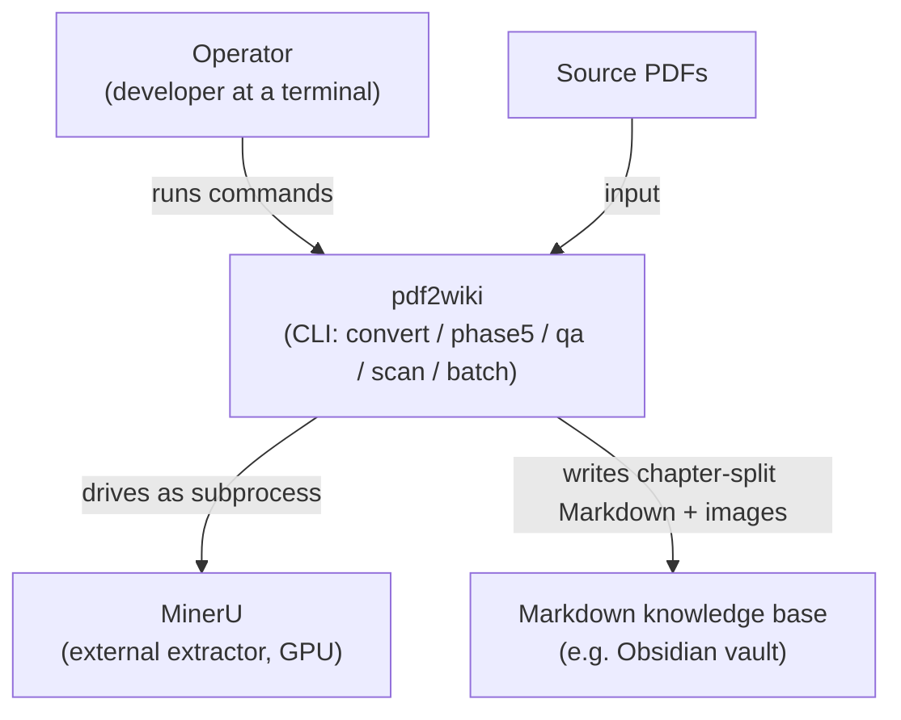
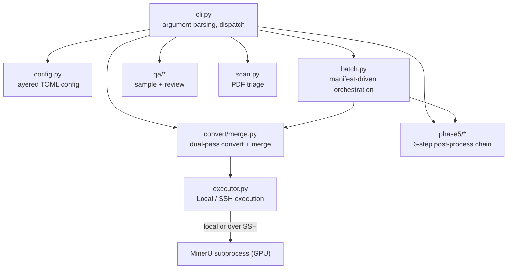
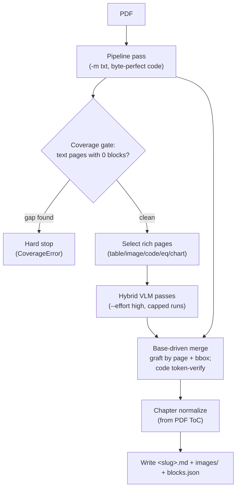
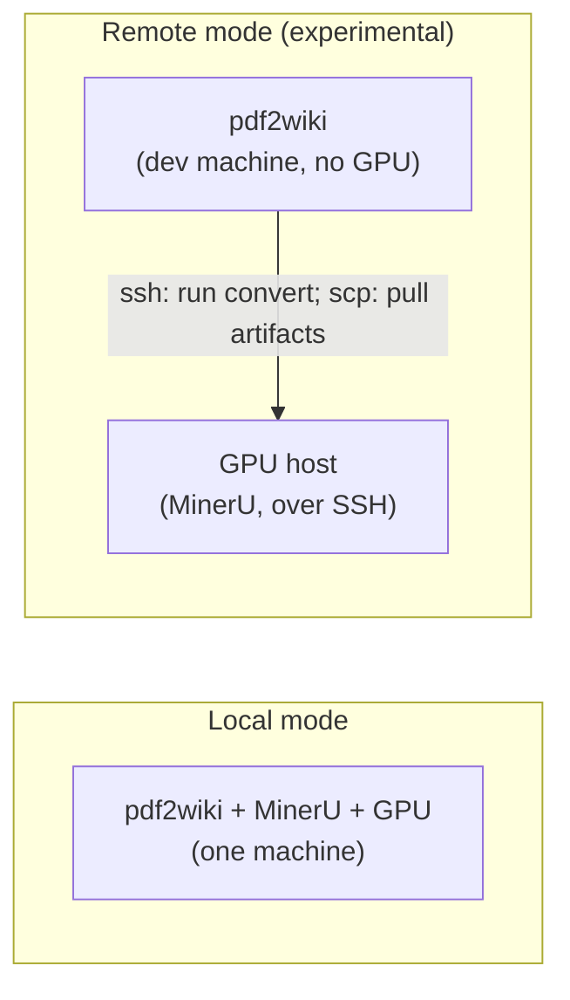

# Architecture

A structured view of how pdf2wiki is built, following an [arc42](https://arc42.org/)-style skeleton
with [C4](https://c4model.com/) diagrams. Diagrams are Mermaid so they live in version control and
render on GitHub and in Obsidian.

## 1. Context and scope

pdf2wiki is a command-line tool that turns a native-text technical-book PDF into clean, chapter-split,
LLM-ready Markdown. It orchestrates the external **MinerU** extractor and adds fidelity-preserving
merge and post-processing. It does not host, serve, or query the output — it produces files.

**Actors and externals:**

- **Operator** — a developer running `pdf2wiki` at a terminal.
- **MinerU** — the external extraction engine (AGPL), driven as a subprocess; needs an NVIDIA GPU.
- **Source PDFs** — the input files.
- **Markdown knowledge base** — the destination (e.g. an Obsidian vault); pdf2wiki writes files into it
  but does not manage it.

### C4 Level 1 — System context

## 2. Building blocks

pdf2wiki is a Python package (`src/pdf2wiki/`) with a thin CLI over independent modules.

### C4 Level 2 — Containers / modules

- **`cli.py`** — subcommand parsing and dispatch; enforces the dry-run-by-default convention.
- **`config.py`** — layered TOML configuration (see [configuration](../reference/configuration.md)).
- **`executor.py`** — `LocalExecutor` and `SSHExecutor`; decides where MinerU runs.
- **`convert/merge.py`** — the [dual-pass convert and merge](../explanation/how-the-merge-works.md).
- **`phase5/`** — the six-step [post-processing chain](../reference/phase5-steps.md).
- **`batch.py`** — resumable multi-book [orchestration](../reference/pipeline-stages.md#stage-3--batch-orchestration-pdf2wiki-batch).
- **`qa/`** and **`scan.py`** — sampling/review and PDF triage.

## 3. Runtime view — converting one book

### C4 Level 3 — convert component flow

Passes are cached behind `.done` sentinels, so a re-run resumes past completed work.

## 4. Deployment view

pdf2wiki runs in one of two topologies. Only the conversion step needs a GPU; `phase5`, `qa`, and
`scan` run anywhere Python runs.

In remote mode the dev machine drives conversion over SSH and pulls the artifacts back with `scp`; see
[set up a remote GPU host](../how-to/set-up-remote-gpu.md).

## 5. Cross-cutting concepts

These are documented as [design principles](../explanation/design-principles.md): dry-run by default,
idempotent post-processors, resumable conversion, the zero-fail coverage gate, never suppressing the
subprocess, a clean working directory for MinerU, connectivity checked once, and sequential batching.

## 6. Architecture decisions

The rationale for the dual-backend design and the code-fidelity strategy lives in
[why a dual-backend pipeline](../explanation/why-dual-backend.md) and
[how the merge works](../explanation/how-the-merge-works.md).

## 7. Quality and risks

- **Alpha.** All stages are functional; the converter was ported from a production deployment validated
  on several books.
- **Remote mode is experimental** — it has no full public end-to-end validation yet; prefer local mode
  for now.
- **Native-text PDFs only.** pdf2wiki relies on an embedded text layer for byte-perfect code; scanned
  (image-only) PDFs are out of scope.
- **Single GPU.** There is no multi-GPU or concurrent path; batches are sequential by design.
