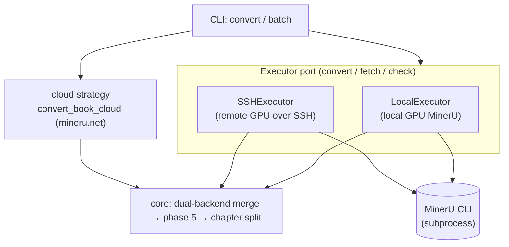

# 0004. Execution backends behind one Executor port (+ cloud strategy)

- Status: accepted
- Date: 2026-07-23 (recorded retrospectively)
- Deciders: Sevthered (maintainer)

## Context and Problem Statement

A conversion can run in more than one place: on the local machine's GPU, on a remote GPU box over SSH, or
GPU-lessly in the mineru.net cloud. The valuable, testable logic — the dual-backend merge, the phase-5
post-processing, chapter splitting — is the same regardless of *where* MinerU ran. The design needed to
keep that core independent of the execution environment, and to let most of the test suite run without a
GPU.

## Considered Options

1. **Branch on environment inline** throughout the pipeline — spreads `if remote / if cloud` everywhere;
   untestable without the real environment.
2. **A driven "run a conversion" port** with concrete adapters, so the core depends on an interface and the
   environment is a swappable implementation (ports-&-adapters / hexagonal).

## Decision Outcome

Chosen: **option 2**, applied pragmatically to what actually varies. Local vs remote *execution* sits
behind an **`Executor`** interface (`convert` / `fetch` / `check`) with two adapters — `LocalExecutor` and
`SSHExecutor`. The GPU-less **cloud** path is a distinct conversion *strategy* (`convert_book_cloud` /
`--cloud-model merge`) selected at the CLI, because it replaces the whole convert step rather than just
relocating it. Within the local convert, `--hybrid-server-url` offloads only the hybrid pass to a BYO
server. The parse boundary (raw MinerU/cloud output → block list) is the seam the tests fake, which is why
the suite runs GPU-free.

### Consequences

- **Good:** the core is environment-agnostic and mostly GPU-free-testable; a new backend is a new adapter,
  not a rewrite; local and remote share one interface so batch orchestration is uniform.
- **Bad / trade-off:** the abstraction is *not* perfectly uniform — cloud is a sibling strategy rather than
  an `Executor` adapter, so there are two selection points (Executor choice + cloud flag) instead of one.
  Folding cloud behind the same port is a possible future simplification, deliberately not done yet.

## More Information

`src/pdf2wiki/executor.py`, `src/pdf2wiki/convert/cloud.py`, `src/pdf2wiki/cli.py` ·
[design principles](../explanation/design-principles.md) ·
[architecture (C4)](../architecture/architecture.md).
